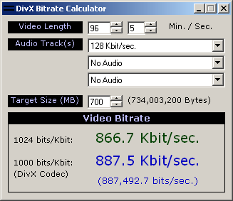



## DivX Bitrate Calculator

### Description

I wrote this simple little program to help me get the best quality DivX encodings by figuring out the maximum video bitrate that will allow the file to barely fit on one CD (700MB). For those of you unfamiliar with DivX, it's the video equivalent of an MP3. It allows you to compress an entire DVD movie to fit on one CD at nearly the same quality.

The bitrate calculator I was using before displayed the bitrate in 1,024-bit kilobits, but the DivX codec uses 1,000-bit kilobits, so my finished files came out about 20MB too small, so that's why I wrote this program.
 
### More Info
 

             |
---                |---
**Submitted On**   |2003-01-07 20:18:02
**By**             |[Jeremiah Hughes](https://github.com/Planet-Source-Code/PSCIndex/blob/master/ByAuthor/jeremiah-hughes.md)
**Level**          |Beginner
**User Rating**    |5.0 (10 globes from 2 users)
**Compatibility**  |VB 6\.0
**Category**       |[Math/ Dates](https://github.com/Planet-Source-Code/PSCIndex/blob/master/ByCategory/math-dates__1-37.md)
**World**          |[Visual Basic](https://github.com/Planet-Source-Code/PSCIndex/blob/master/ByWorld/visual-basic.md)
**Archive File**   |[DivX\_Bitra152569172003\.zip](https://github.com/Planet-Source-Code/jeremiah-hughes-divx-bitrate-calculator__1-42263/archive/master.zip)

